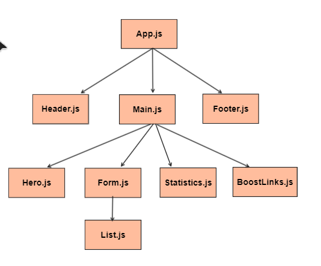

# URL Shortener:

## Project Overview:
- **URL shortening** is a technique on the Web in which a Uniform Resource Locator (URL) may be made substantially shorter and still direct to the required page. 
- This is achieved by using a redirect that links to the web page that has a long URL. 
- For example, the URL "https://example.com/assets/category_B/subcategory_C/Foo/" can be shortened to "https://example.com/Foo", and the URL "http://example.com/about/index.html" can be shortened to "https://goo.gl/aO3Ssc ".

## Tecnologies Used;
- React JS
- Redux
- CSS

## API Used:
- [shrtcode API](https://shrtco.de/docs)

## Projects Links:
- [Live URL](https://shortly-url-shortener-bj.netlify.app/)
- [Commit History](https://github.com/BoshraJaber/url-shortner/commits/main)
- [Report a Bug](https://github.com/BoshraJaber/url-shortner/issues)

## UI Tree:

## Project Screenshots:

